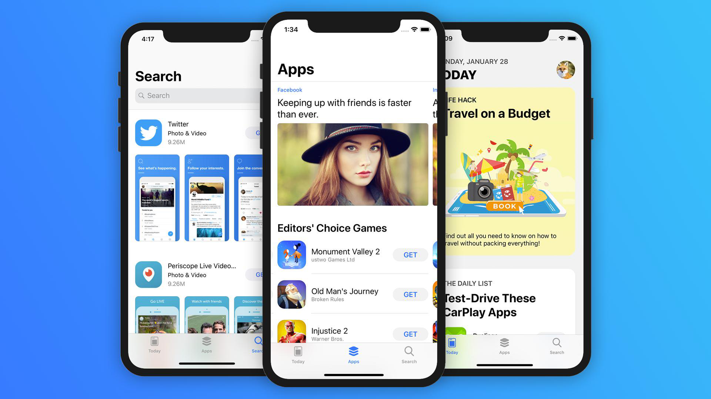

# AppStore
<p align="center">
    <a href="http://cocoadocs.org/docsets/Cards">
        </a>
    <a href="http://cocoadocs.org/docsets/Cards">
        </a>
    <a href="https://github.com/PaoloCuscela/Cards/blob/master/LICENSE">
        </a>
</p>

## Screenshots



### Today
&nbsp;
&nbsp;
&nbsp;

### Apps
&nbsp;
&nbsp;
&nbsp;

### Search
&nbsp;

## Core Concepts
- UICollectionView
- UITabBarController
- UISearchController
- UIStackViews Layout
- Child View Controller
- Snapping Flow Layout
- JSON Decodable
- Asynchronous Date Fetch
- DispatchGroup Synding
- Custom Animations
- SDWebImage Caching
- Generics

## Building and Running

The following commands will set up AppStore
```sh
cd AppStore
pod install
```

## License
MIT License. See [LICENSE](https://github.com/gannasong/AppStore/blob/master/LICENSE).
